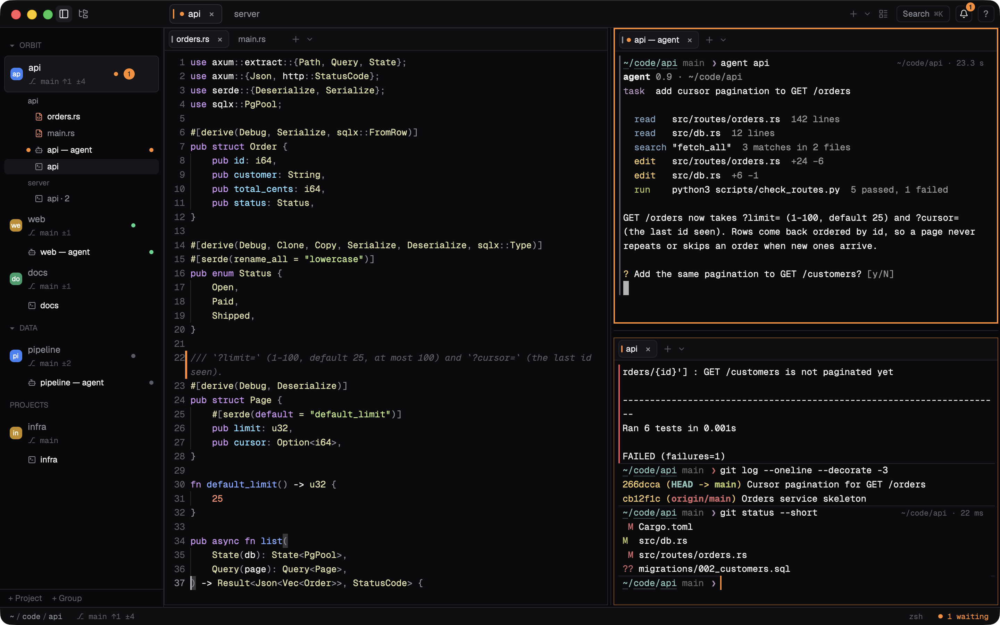
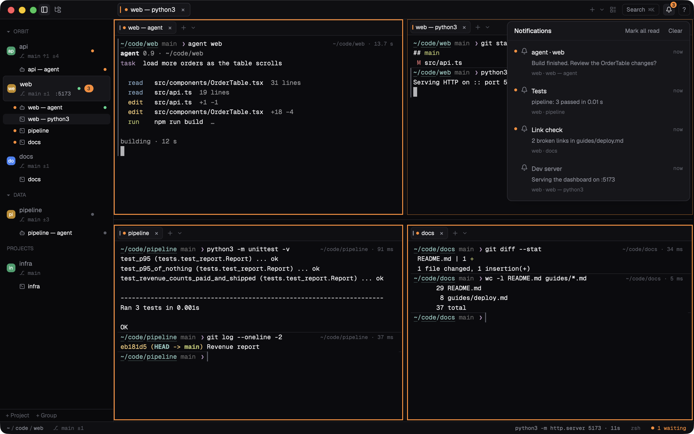
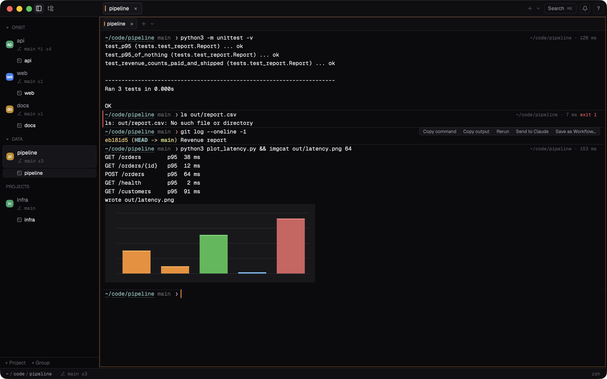
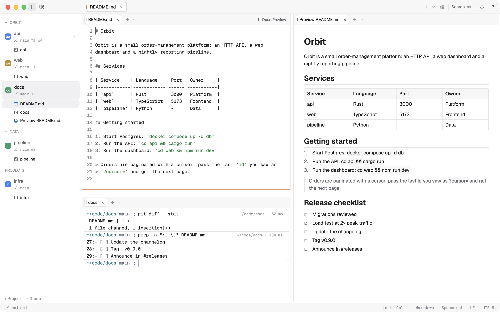
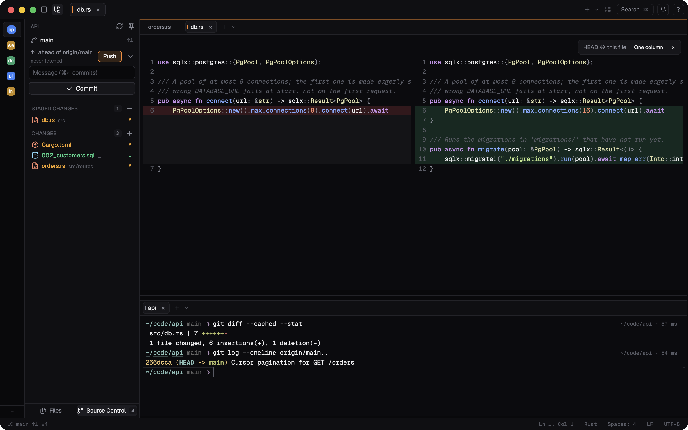
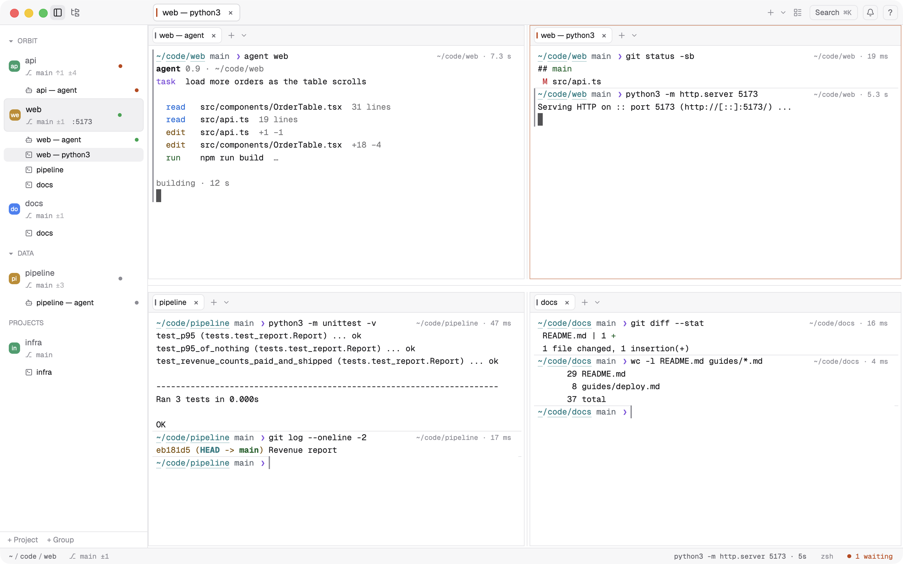
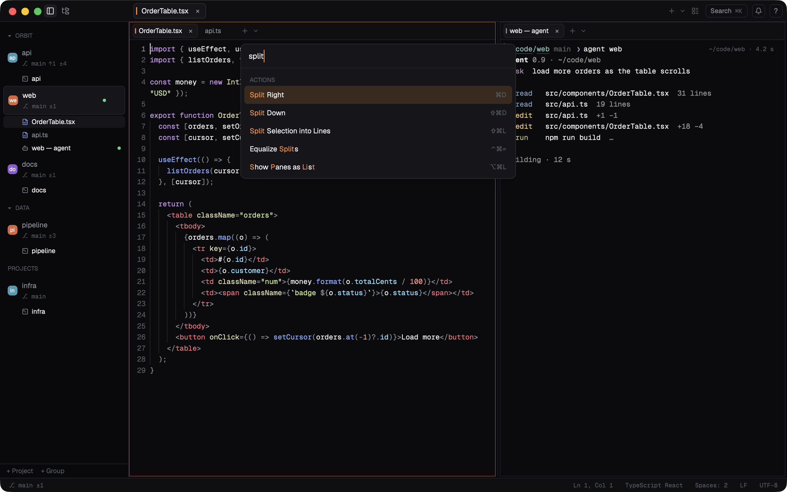
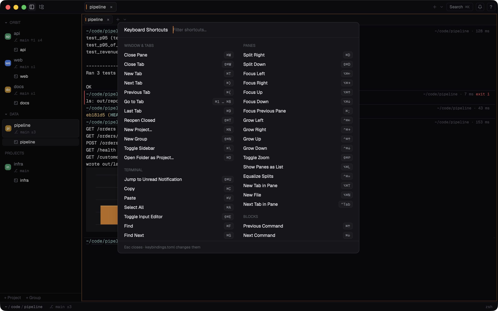
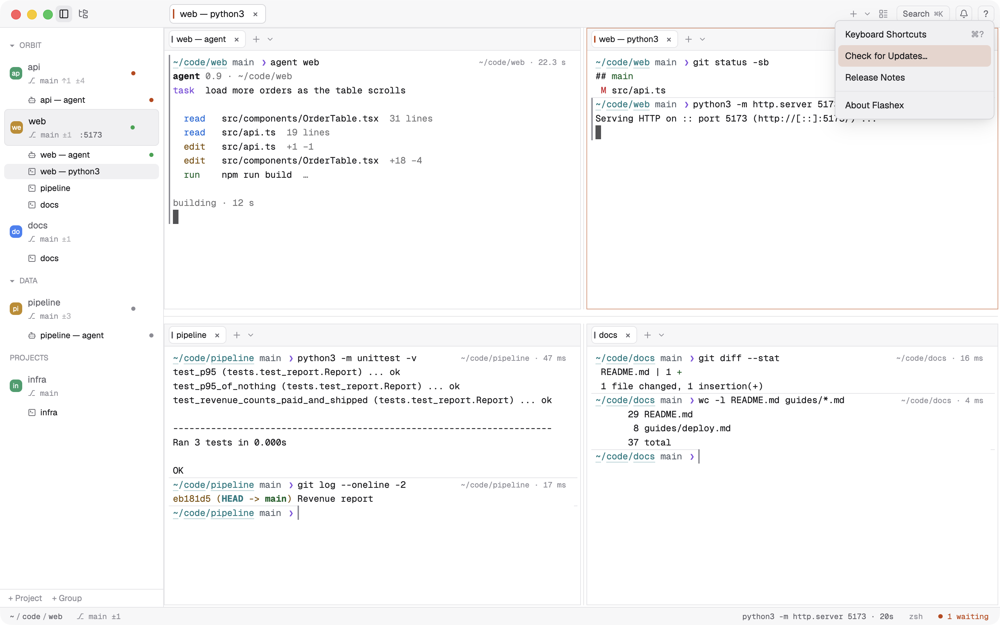

<div align="center">


# Flashex

**A fast macOS terminal built for AI coding agents.**<br>
Its own VT core, an editor with language servers, Source Control and agent-aware panes, in one native app.

[](https://github.com/palo-kunovsky-flash/flashex-app/releases/latest)
[](CHANGELOG.md)
[](#requirements)
[](#linux-beta)
[](#requirements)
[](#licence)
[](https://github.com/palo-kunovsky-flash/flashex-app/releases)

| | Download |
|---|---|
| **macOS** (Apple Silicon, 13+) | [**Flashex-macOS-arm64.dmg**](https://github.com/palo-kunovsky-flash/flashex-app/releases/latest/download/Flashex-macOS-arm64.dmg) · or `brew install --cask palo-kunovsky-flash/flashex/flashex` |
| **Linux** (beta, x86_64 / arm64) | [AppImage, .deb or .tar.gz (0.1.2)](https://github.com/palo-kunovsky-flash/flashex-app/releases/tag/v0.1.2) · see [Linux (beta)](#linux-beta) |
| **Windows** | planned |

[Install](#install) · [Features](#features) · [Performance](#performance-and-memory) · [Shortcuts](#keyboard-shortcuts) · [Privacy](#privacy) · [Changelog](CHANGELOG.md) · [All releases](https://github.com/palo-kunovsky-flash/flashex-app/releases)

</div>



- **Its own fast terminal core.** `flashex-vt` is written for Flashex in Rust. It prints SGR-heavy output in about half the CPU instructions per byte that libghostty-vt needs, passes 450 esctest2 tests where Ghostty's core passes 272, and has run hours of fuzzing without a failure. [Numbers below.](#performance-and-memory)
- **Built for AI agents.** Claude Code hooks (`flashex setup claude`) tell Flashex when an agent is running, waiting for you or done. The sidebar shows every agent's state as a dot, notifications point at the exact terminal, and a finished Claude Code session can be resumed from its command block.
- **Warp-style command blocks.** Every command is a block with its folder, duration and exit code. Jump between blocks, select or fold one, copy its command or output, rerun it, send it to Claude or save it as a workflow.
- **A real editor with LSP.** Tree-sitter highlighting, multi-cursor editing in the style of Sublime Text and VS Code, go to definition, references, hover, completion, rename and diagnostics from the language servers you already have installed.
- **Source Control.** Stage, unstage, discard, commit, pull, push and switch branches, with side-by-side diffs against HEAD.
- **Inline images.** The kitty graphics protocol, sixel and iTerm2 images, drawn in place and scrolling with the text.
- **Premium animations.** Splits, zoom, tabs, the sidebar and popups move at the display's frame rate. Each motion can be interrupted and they all turn off with macOS Reduce motion.
- **A restart keeper.** A tiny helper process holds your terminals while Flashex restarts for an update or after a crash. Shells, agents and running jobs carry on and reconnect when the app comes back.

Flashex is free to use. It runs on Apple Silicon Macs with macOS 13 or later. [Install it.](#install)

---

## Contents

- [Features](#features)
- [Performance and memory](#performance-and-memory)
- [Install](#install)
- [Updates](#updates)
- [Requirements](#requirements)
- [Keyboard shortcuts](#keyboard-shortcuts)
- [Configuration](#configuration)
- [Privacy](#privacy)
- [Support Flashex](#support-flashex)
- [Licence](#licence)

## Features

### Agents

Run Claude Code (or any agent) in as many terminals as you like and see them all at a glance. The sidebar lists each project's terminals, editors and browser panels, with a robot icon for a terminal running Claude Code and a dot for its state: orange when it waits for you, green while it runs, red on an error. A pane with an unread notification gets an orange frame. `Cmd+Shift+U` jumps to the oldest unread notification, and the bell opens the notification history.



- `flashex setup claude` installs the hooks in `~/.claude/settings.json` (it shows the change and asks first, and keeps a backup).
- When Claude Code ends, its block offers **Resume Claude** (`claude --resume <id>` in the folder it ran in). After a restart, a terminal where Claude Code was running offers `claude --continue`. Nothing runs until you click.
- Any program can notify: OSC 9, 777 and 99, a bell, or `flashex notify`. A command that took 10 s or more and finished out of sight notifies too.
- The `flashex` command controls the app from scripts and agents: `flashex split right`, `flashex send`, `flashex read --last-block`, `flashex open src/main.rs:10`, `flashex agent waiting`, `flashex events` (a JSON stream of commands, notifications and agent states). Programs that can write to a Unix socket can use the same JSON-RPC API.

### AI help (optional)

Flashex works with the AI you already have, and never needs an API key: Claude Code, Codex or Gemini CLI (their own login), your own command, or any OpenAI-compatible server, including local models in Ollama, LM Studio or llama.cpp. Nothing is sent until you press Enter on a `#` line or click.

- **`# <what you want>` + Enter** at an empty prompt, for example `# find files bigger than 100 MB`, asks for one shell command for your system, shell and folder. The command is put into the line for you to check; it never runs by itself, and the `#` line never reaches your shell or its history. Esc cancels.
- **Explain** and **Fix** on a failed command's block. With an agent running in the project, the question is typed into its terminal (you press Enter there); otherwise the answer from your provider shows next to the block, and **Insert fix into prompt** puts a suggested command into the line.
- **Send to Claude / Codex / Gemini…** on a block types its command, folder, exit code and output (only its start and end when long) into that agent. With several agents running you pick one; with none, **Send to AI…** asks your provider.
- **Suggestions from your history** as you type, in grey after the cursor (no AI, offline): the command you ran in this folder first, then in this project, then anywhere. → or End takes it, ⌥→ one word. Commands that look like they contain a password or a token are never suggested. If your shell suggests on its own (zsh-autosuggestions, fish), Flashex leaves its line alone.

Settings › AI picks the provider (by default the first of Claude Code, Codex and Gemini CLI that is installed), the server and model, stores the API key in the Keychain, and has **Test connection**, which lists the server's models. `[ai] enabled = false` turns every AI feature off.

### Command blocks and inline images



Shell integration for zsh, bash and fish turns every command into a block. `Cmd+↑/↓` jumps between commands, `Cmd+Shift+↑/↓` selects whole ones, and `Cmd+Option+[` folds a finished command's output. A block's hover tools copy the command or its output, rerun it, fold it, send it to Claude or save it as a reusable workflow with parameters. The compact prompt shows the folder and git branch. Click the folder to jump elsewhere.

Pictures from `kitty +kitten icat`, `chafa`, `timg`, `yazi`, `img2sixel` or `imgcat` show inline and belong to their block (folding the block hides them). Each terminal keeps at most 64 MB of decoded images by default.

Also in the terminal: `Cmd+F` search across the whole history (regex, whole word, case), `Cmd+click` on paths such as `src/main.rs:10:5` and on links, an input editor with syntax colours and history suggestions, and ssh that works with nothing installed on the server.

### Editor and language servers

- Tree-sitter highlighting for Rust, TypeScript, JavaScript, Python, Go, Swift, Kotlin, JSON, TOML, YAML, Markdown, Bash, HTML, CSS and SQL, including languages embedded in others (code blocks in Markdown, scripts in HTML).
- Multiple cursors, column selection, line moves, comment toggling and bracket matching, with key profiles for `flashex`, `sublime` and `vscode` conventions.
- Language servers that are already on your system (rust-analyzer, typescript-language-server, pyright, gopls, sourcekit-lsp, …) give diagnostics, go to definition (`F12`), references (`Shift+F12`), hover (`Cmd+I`), completion and rename (`F2`). The palette's **Language Servers…** lists each language's server and how to install it. Servers that run a project's code ask first in a folder that is not one of your projects.
- `Cmd+P` opens files in the project, and unsaved and untitled editors survive quitting.
- Markdown files render side by side (`Cmd+Option+V`) and follow what you type.



### Source Control



The sidebar and the status bar show each project's branch with `↑` commits to push, `↓` commits to pull and `±` changed files (`main ↑1 ±4`); hover them for the same in words. The file tree's **Source Control** view shows the branch, how it stands against its upstream, and staged and unstaged changes. Click a file for its diff against HEAD, then stage, unstage or discard. Commit with `Cmd+Enter` using your own git config (signing and hooks). One button does Pull, Push, Sync, Publish Branch or Fetch, whichever fits. `Cmd+Option+B` switches or creates branches. Git never prompts for credentials, and nothing is stashed, merged or forced without asking.

### Projects, groups, splits

Projects live in the sidebar, optionally in groups, each with its own tabs and split layout. Splits can be resized by cells or percent (`flashex size 60%`), zoomed (`Cmd+Shift+Enter`) or shown as a list on a small screen. Layouts can be saved as templates, and closed projects, tabs and panes come back with `Cmd+Shift+T`. The whole session (groups, projects, tabs, splits, editors) is restored at the next start.



### Command palette and shortcuts



`Cmd+K` finds any action, project or tab. `Cmd+?` lists every shortcut in effect and filters them as you type.



### Light and dark

Flashex follows the macOS appearance by default. Settings › Terminal colors offers Flashex's own colour schemes (Graphite, Harbor, Ember), each with a dark and a light variant; `theme` takes `dark`, `light`, `system`, a scheme such as `graphite-dark`, or the name of a theme file in `~/.config/flashex/themes` (`"light:<name>,dark:<name>"` picks one for each appearance), and the accent colour can be orange, green, blue, indigo, teal or amber. The grid and the Markdown preview above are in the light theme.

### Restart keeper

Terminals survive a crash of Flashex and a restart for an update. `flashex-keeper`, a small helper (a 551 KB binary, 1.3–1.7 MB of memory with one terminal), holds the shells while the app is gone, for at most 10 minutes by default and with up to 4 MB of output kept per terminal. The next start takes them back with the same processes, shows "Reconnected N terminals" and what they printed meanwhile. Quitting with `Cmd+Q` still ends every terminal and leaves no helper running. Turn it off with `[session] keeper = false`.

## Performance and memory

Every number here was measured by the Flashex project and recorded in its (private) development notes. The source file for each is named in brackets. Unless noted otherwise, the machine was an **Apple M4 with macOS 26.6.2, Rust 1.99.0 and a release build**. Some runs shared the machine with other heavy work (fuzzing, builds). Where that matters the table says so, and processor instructions are compared rather than wall-clock time.

### The terminal core against libghostty-vt

`flashex-vt` replaced libghostty-vt (Ghostty's VT library, which Flashex started on) as the default core. Both were measured with the same benchmark: a 120×40 terminal fed 4 × 32 MiB in 64 KiB chunks, with the data generation run subtracted, counting CPU instructions retired per input byte (`/usr/bin/time -l`). Lower is better.

| Data | flashex-vt (instructions/byte) | libghostty-vt (instructions/byte) |
|---|---|---|
| ASCII text | 27.50 | 26.43 |
| Unicode (CJK, emoji, combining) | 103.93 | 104.16 |
| SGR-heavy (colours and styles on every few characters) | 114.50 | 223.67 |

[`docs/perf/2026-10-07-vt-print.md`, averages of 3 runs, all columns built and measured the same day.] A later change made SGR output a further 10.9% cheaper (114.20 → 101.80 instructions/byte) with ASCII and Unicode unchanged [`docs/perf/2026-10-07-vt-images.md`].

By wall clock, during an earlier check: about 590 MB/s for ASCII (Ghostty ~600), 152 MB/s for SGR (Ghostty ~64) and 163 MB/s for Unicode (Ghostty ~167) [`docs/perf/2026-10-04-check.md`; that run shared the machine with a fuzzer, so the instruction counts above are the reliable comparison].

### Conformance: esctest2

esctest2 with `--max-vt-level 5` (567 tests), both cores in the same harness:

| Core | Passed | Known/skipped | Failed |
|---|---|---|---|
| **flashex-vt** | **450** | 35 | 82 |
| libghostty-vt | 272 | 35 | 260 |

[`docs/plans/2026-10-07-vt-complete.md`] Each of flashex-vt's 82 remaining failures is a deliberate choice, listed with its reason. They cover X11 colour spaces and special colours, programs moving or resizing the window or reading its title, reading the clipboard (programs may write it, never read it), reporting as a VT525 instead of a VT220, and a few modes for printers and NRC sets.

### Fuzzing

Long runs of the structured fuzzer (escape sequences, random bytes, resizes from 1×1 to 500×200, selection, keys, mouse, paste and, in the latest generator, inline images), each on the final code of its branch, ended with no crash, no hang and bounded memory:

| Run | Duration | Cases | Operations |
|---|---|---|---|
| inline images | 3,600 s | 277,033 | 332,085,592 |
| VT completion | 3,600 s | 242,716 | 290,845,071 |
| print fast path | 3,600 s | 227,546 | 272,756,336 |
| switch to flashex-vt | 26 min | 124,776 | 149.5 million |

[`docs/plans/2026-10-07-vt-images.md`, `docs/plans/2026-10-07-vt-complete.md`, `docs/plans/2026-10-07-vt-improve.md`, `docs/plans/2026-10-03-vt-c-switch-ready.md`] On top of that come differential tests against libghostty-vt: a corpus of hand-written cases plus generated streams compared cell by cell, 300-seed soaks with and without resizes and recorded real sessions, more than 100,000 key-encoding comparisons and 200,000 random input events [`docs/plans/2026-10-03-vt-b-unicode-reflow-input.md`, `docs/plans/2026-10-07-vt-complete.md`].

### Latency, frames, startup

| Measurement | Result | How | Source |
|---|---|---|---|
| Key → frame ready (terminal core, no drawing) | median **71–74 µs**, p95 82–97 µs | `key_latency`: 200 keys through a PTY to `cat` | `docs/perf/2026-10-04-check.md` |
| The same with the restart keeper on | median 76 µs (77 µs without) | 6 runs each, heavily loaded machine | `docs/perf/2026-10-08-keeper.md` |
| Frame build during animations | under **4.5 ms** for every motion, typically 0.3–2 ms | `FLASHEX_FRAME_LOG=1`, GUI pass 10, 60 Hz display | `docs/plans/2026-10-06-gui-verification.md` |
| Frame interval during animations | **16.7–17.7 ms** at 60 Hz for splits, zoom, tabs, sidebar, palette | same | same |
| Main-thread work between frames | at most **1.1 ms** (saving the session) | same | same |
| Startup to the first shell prompt | median **148 ms** | `--measure-startup`, median of 5 after a warm-up, empty temporary HOME (no `.zshrc`) | `docs/perf/2026-10-04-check.md` |
| Startup with the restart keeper on | 156 and 164 ms (152 and 158 ms off) | same method | `docs/plans/2026-10-06-gui-verification.md` (pass 11) |

Startup was measured with an empty shell configuration, so your own `.zshrc` adds its time on top.

### Memory and CPU

| Measurement | Result | Source |
|---|---|---|
| Idle app, one window, one terminal | physical footprint **41–46 MB** (`vmmap --summary`; RSS 94–97 MB including shared system libraries) | `docs/perf/2026-10-04-check.md` |
| One terminal core with 10,000 lines of scrollback | **1.47 MB** (libghostty-vt: 10.70 MB) | `docs/perf/2026-10-04-check.md` (`pane_memory`, average of 20, 106-character lines) |
| Core with 10,000 lines: typical / full ASCII / full CJK lines | 1.65 / 2.13 / 4.60 MB (libghostty-vt: 11.9 MB each) | `docs/perf/2026-10-04-check.md` (`vt_memory`) |
| 20 terminals with full 10,000-line histories | 23.3 MB of core heap, **1.17 MB per terminal** | `docs/perf/2026-10-07-vt-complete.md` |
| 1,000,000-line history after 2,000,000 lines of output | stays at exactly 1,000,000 lines and 93.2 MB (~93 bytes per line) | `docs/perf/2026-10-07-vt-complete.md` |
| An idle terminal (core, PTY, threads, child process) | +2.3 MB, 4 threads; 10 idle terminals: 1.65 MB each | `docs/perf/2026-10-04-check.md` (`idle_panes`) |
| Idle CPU | app: **0.01 s of CPU in 10 s**; an idle terminal: 0.003 ms of CPU per second | `docs/perf/2026-10-04-check.md` |
| Browser and language servers when not used | **0 MB extra**: no LSP thread or server process, same footprint with and without the browser panel compiled in | `docs/perf/2026-10-04-check.md` |
| Full path PTY → core with the keeper on and off | 17.1 / 17.7 ms of app CPU per MiB (best run, median of 6 series); keeper: 0 bytes read, no measurable CPU | `docs/perf/2026-10-08-keeper.md` |

### Editor

| Measurement | Result | Source |
|---|---|---|
| Open a 10,000-line file | 0.33–0.38 ms | `docs/perf/2026-10-04-check.md` |
| Search 10,000 lines (literal / regex) | 0.85–0.93 / 0.86–0.90 ms | same |
| Keystroke → new syntax tree, ~15,000 lines of Rust (mean / worst) | 0.65–0.81 / 1.3–1.6 ms | same |
| Keystroke in a 10 MB file (mean) | 3.37 ms | same |
| Next frame with a 2 MB line | 0.17 ms | same |

### Size

| What | Size | Source |
|---|---|---|
| `flashex-app` release binary (everything compiled in, fonts included) | 33.5 MiB (35.1 MB) | `docs/perf/2026-10-04-check.md` |
| `flashex-keeper` release binary | 551 KB | `docs/perf/2026-10-08-keeper.md` |

## Install

### Homebrew (recommended)

```sh
brew install --cask palo-kunovsky-flash/flashex/flashex
```

The cask installs `Flashex.app` into `/Applications`, links the `flashex` command, and removes the quarantine flag after Homebrew has checked the download's SHA-256, so the app opens normally the first time.

### Download the dmg

1. Download [`Flashex-macOS-arm64.dmg`](https://github.com/palo-kunovsky-flash/flashex-app/releases/latest/download/Flashex-macOS-arm64.dmg) (always the latest version; each release also has a versioned `Flashex-<version>.dmg` with its `.sha256`).
2. Optionally check it (see [Updates](#updates)).
3. Open it and drag **Flashex** to **Applications**.
4. **The first time**, right-click (or Control-click) Flashex in Applications and choose **Open**, then **Open** again in the dialog. Or run:

   ```sh
   xattr -dr com.apple.quarantine /Applications/Flashex.app
   ```

**Why this step?** Flashex is free and made by one developer without a paid Apple Developer account. It is signed, but not with an Apple Developer ID, and it is not notarized by Apple. macOS Gatekeeper therefore refuses a downloaded copy until you confirm once that you want to run it. After that it opens like any other app, and updates installed by Flashex itself do not ask again. Homebrew does this step for you.

To use the `flashex` command after a dmg install, link it into your `PATH`:

```sh
ln -s /Applications/Flashex.app/Contents/MacOS/flashex /opt/homebrew/bin/flashex
```

(Inside a Flashex terminal the command is always available.)

### Linux (beta)

Download from the [0.1.2 release](https://github.com/palo-kunovsky-flash/flashex-app/releases/tag/v0.1.2) for your architecture (the newest Linux build; later versions are macOS only for now) (`x86_64` or `aarch64`):

- **AppImage** (updates itself):

  ```sh
  chmod +x Flashex-<version>-linux-<arch>.AppImage
  ./Flashex-<version>-linux-<arch>.AppImage
  ```

  It needs FUSE (`fuse3` / `fusermount3`); without it, run it with `--appimage-extract-and-run`.
- **Debian / Ubuntu:** `sudo apt install ./flashex_<version>_<arch>.deb`. When a new version is out, Flashex downloads the verified package and shows the same command.
- **tar.gz:** extract it anywhere and run `flashex-app`.

Each file has a `.sha256` next to it, and updates are verified with the same signature as on macOS.

The Linux build is new, so expect rough edges. Known gaps:

- There is no built-in browser panel; links open in your browser.
- There is no menu bar; every command is in the command palette (the Search button at the top right).
- Shortcut labels still show the macOS `⌘` symbols.
- On Wayland the window has no close or minimise buttons yet.

[Bug reports](https://github.com/palo-kunovsky-flash/flashex-app/issues) are very welcome.

## Updates

Flashex checks for a new release at start and then once a day, by asking GitHub for the latest release of this repository. When one is available, a card offers **Release Notes**, **Update** and **Later**. Nothing is downloaded or installed until you choose **Update**, and the restart waits for **Restart Now**.

Every update is verified before it replaces anything:

- The release manifest (`flashex-update.json`) is signed with the project's own ECDSA P-256 key. Its public half is built into the app, and the signature is checked with macOS's Security framework. It covers the version, the size and the SHA-256 of the dmg.
- The download must have exactly that size and SHA-256.
- The new app's version and code signature are checked before it is swapped in. If the new version cannot be launched, the old one is put back.

To look right away, choose **Check for Updates…** in the **?** menu at the top right (also in the Flashex menu and the command palette). The same menu has the release notes and the version.



Your terminals keep running through the update thanks to the restart keeper. Turn the check off in Settings › Updates or with `[updates] check = false`. If Flashex is in a folder it cannot write to, it offers the verified dmg in Finder instead.

**Check a download yourself.** Each release lists the dmg's SHA-256 and ships `Flashex-<version>.dmg.sha256` next to it:

```sh
shasum -a 256 -c Flashex-<version>.dmg.sha256
# or compare by eye:
shasum -a 256 Flashex-<version>.dmg
```

If you installed with Homebrew, `brew upgrade --cask flashex` also works. The cask is marked `auto_updates`, so Homebrew leaves updating to the app unless you pass `--greedy`.

## Requirements

- A Mac with **Apple Silicon** (M1 or later). Intel Macs are not supported.
- **macOS 13 Ventura or later.**
- **Linux (beta):** x86_64 or arm64 with glibc 2.35 or later (Ubuntu 22.04, Debian 12, Fedora 36 and newer), X11 or Wayland.
- Windows: later.

## Keyboard shortcuts

A summary of the defaults. `Cmd+?` in the app shows every shortcut in effect.

| Area | Keys |
|---|---|
| Palette, files, settings | `Cmd+K` command palette · `Cmd+P` go to file · `Cmd+,` settings · `Cmd+?` all shortcuts |
| Tabs | `Cmd+T` new tab · `Cmd+W` close pane · `Cmd+Shift+W` close tab · `Cmd+1…9` go to tab · `Cmd+Shift+T` reopen closed |
| Splits | `Cmd+D` split right · `Cmd+Shift+D` split down · `Cmd+Option+arrows` move focus · `Cmd+Ctrl+arrows` resize · `Cmd+Shift+Enter` zoom · `Cmd+Option+L` panes as list |
| Projects | `Cmd+N` new project · `Cmd+Shift+N` new group · `Cmd+O` open folder · `Cmd+\` sidebar · `Cmd+B` file tree |
| Terminal | `Cmd+F` find · `Cmd+↑/↓` previous/next command · `Cmd+Shift+↑/↓` select commands · `Cmd+Option+[` / `]` fold/unfold output · `Cmd+Shift+U` unread notification |
| Editor | `Cmd+D` next occurrence · `Cmd+/` comment · `Option+↑/↓` move lines · `Cmd+Shift+L` cursor per line · `F12` definition · `Shift+F12` references · `Cmd+I` hover · `Ctrl+Space` complete · `F2` rename |
| Git | `Cmd+Option+B` switch branch · `Cmd+Enter` commit (in Source Control) |

The `sublime` and `vscode` key profiles (`[keys] profile`) switch editor keys to those editors' conventions, and `~/.config/flashex/keybindings.toml` changes any shortcut.

## Configuration

Flashex reads `~/.config/flashex/config.toml` and applies changes as soon as you save. The file is created with comments for every option, and Settings (`Cmd+,`) edits the same file while keeping your comments. A few common ones:

```toml
[appearance]
theme = "system"          # dark | light | system | graphite-dark | …
accent = "orange"         # green, blue, indigo, teal, amber
animations = true

[terminal]
font_family = "Geist Mono"
font_size = 13
scrollback_lines = 10000

[session]
keeper = true             # terminals survive restarts and crashes

[keys]
profile = "flashex"       # or "sublime", "vscode"

[updates]
check = true

[ai]
enabled = true
# provider = "openai-compatible"           # or claude, codex, gemini, command
# base_url = "http://localhost:11434/v1"   # Ollama; LM Studio: http://localhost:1234/v1
# model = "qwen2.5-coder:7b"
ghost_text = true                          # suggestions from your history
```

Other files: `keybindings.toml`, `layouts.toml` (layout templates) and `workflows.toml` (saved commands) in the same folder, and `<project>/.flashex/workflows.toml` for a project's own workflows. App data (session, backups of unsaved editors) is in `~/Library/Application Support/flashex`, logs in `~/Library/Logs/flashex`.

## Privacy

Flashex has **no telemetry, no analytics, no accounts and no crash reporting**. It sends nothing about you or your work anywhere.

The network connections it makes are:

- **The update check:** a request to `api.github.com` for this repository's latest release, at start and at most once a day, then the manifest and, only if you choose **Update**, the dmg from GitHub. It runs through the system's `/usr/bin/curl`, HTTPS only. GitHub sees your IP address, as with any download. Turn it off with `[updates] check = false`. Development builds never check.
- **The browser panel:** only the pages you open in it. Text typed in its address bar that is not an address is searched with DuckDuckGo (`[browser] search_url`, `""` turns it off).
- **Git:** only what you start (fetch, pull, push, branch Fetch), using your own git and credentials. Background fetching is off unless you set `[git] autofetch_minutes`.
- **Language servers** are programs already installed on your system, started by Flashex as local processes. Flashex does not download them. What a server itself does (rust-analyzer running `cargo`, for example) is up to that server.
- **AI help, only when you ask.** Nothing is sent until you press Enter on a `# …` line at a prompt, or click Explain, Fix, Send to AI… or Test connection. Then:
  - **`#` → command** sends your request (only what you typed after `#`), your operating system, your shell's name and the current folder (as `~/…`). Your last command and its exit code are sent only if you turn on Settings › AI › "# also sends your last command" (`[ai] send_last_command`, off by default), and never when it looks like it contains a secret. No environment variables, files or other output.
  - **Explain, Fix and Send to AI…** send that block's command (passwords and tokens in it replaced by `***`), folder, exit code and output, trimmed to its first and last lines (`[ai] output_lines`, 200 by default, and `output_kb`, 16 KB), saying that it was trimmed. The row's tooltip says what it sends, and its name says where it goes ("Fix with Claude (tab 2)").
  - **Where it goes** is your `[ai] provider`: the `claude`, `codex` or `gemini` program on your computer, which sends it to Anthropic, OpenAI or Google under your own login and their terms, run in an empty temporary folder so it reads none of your project's files, with no tools it could act with (Claude Code: no tools, no MCP servers, plan mode; Codex: read-only sandbox; Gemini: never auto-approve); your own `command`, which gets it on its standard input; or an OpenAI-compatible server at `[ai] base_url` (`POST /chat/completions`, through `/usr/bin/curl`, HTTPS except for `localhost`, `127.0.0.1` and `::1`), which with a local model never leaves your computer. **Test connection** sends `GET /models` to that server and nothing else.
  - **Send to Claude / Codex / Gemini** with an agent running in a terminal only types the same report into that terminal; it is sent when you press Enter there. Nothing is typed into a terminal that is back at its shell prompt, or one that does not accept pasted text safely.
  - The API key is kept in the macOS Keychain (Linux: a file only you can read), never in `config.toml`, and is sent only to your server, as an `Authorization` header that does not appear in the process list. Opening Settings never reads it; if it cannot be read (Keychain access denied), nothing is sent.
  - Suggestions from your history are computed on your computer and never sent.
- **The Usage dashboard** reads Claude Code's transcripts (`~/.claude/projects`, or `$CLAUDE_CONFIG_DIR`) on your computer while it is on screen: only timestamps, model names, token counts, the length of visible text, the session id and the last name of the working folder. No message text is kept or logged; its summary cache in Flashex's cache folder (`~/Library/Caches/flashex`) holds those numbers only. Rate limits come from Claude Code's status line, through a file your status-line script writes (`~/Library/Caches/flashex/statusline.json`, on Linux `$XDG_CACHE_HOME/flashex` or `~/.cache/flashex`, or cc-meter's `~/.cache/cc-meter/statusline.json`); Flashex never edits your status line or Claude Code's settings. Two network requests exist, both off unless you turn them on:
  - **Show Claude status** (a button in the dashboard, `[agents] claude_status`): a `GET` of `https://status.claude.com/api/v2/summary.json`, Anthropic's public status page, once a minute while the dashboard is open. Nothing is sent but the request itself (your IP address and a `Flashex/<version>` user agent).
  - **Use the Anthropic usage API when status-line data is missing** (Settings › AI agents, `[agents] usage_api`): when no status line has reported your limits for a minute, Flashex reads Claude Code's own login (the macOS Keychain item "Claude Code-credentials", or `.credentials.json`) and sends a `GET` to `https://api.anthropic.com/api/oauth/usage` with it, at most once a minute while the dashboard is open (`u` asks at once), backing off when Anthropic answers HTTP 429. The token goes to curl on its standard input, never on the command line, and nowhere else. With the setting off, the login is never read.
- **The System dashboard** reads this Mac's own counters, in-process and without root (Mach and `sysctl` for CPU and memory, libproc for your processes, IOKit for the GPU, disks, battery and temperature sensors, the interface counters and SystemConfiguration for the network), only while it is on screen. Two commands run on their own: `ps` every 16 seconds for processes of other users (the window server, root's daemons), which an app cannot read itself, and `nettop` every 10 seconds for the busiest processes on the network. Nothing is stored; the charts' history lives in memory and goes when the dashboard closes. One network request exists, off unless you turn it on:
  - **Public IP** (a button in the dashboard's header, `[dashboards] public_ip`): a `GET` of `https://api.ipify.org` every five minutes while the dashboard is on screen, to show the address the internet sees. Nothing is sent but the request itself (your IP address and a `Flashex/<version>` user agent). Off, the address is never asked for.

Everything else stays local. The `flashex` command talks to the app over a Unix socket that only your user can open (`0600`). Programs in the terminal may write to the clipboard (OSC 52, `[terminal] clipboard_write`) but can never read it. Command lines that look like they contain a secret are never saved in the session.

## Support Flashex

Flashex is free, and the best way to support it costs nothing:

- **Star** [this repository](https://github.com/palo-kunovsky-flash/flashex-app). It helps other people find Flashex.
- **Tell a friend** or a colleague who lives in the terminal or works with AI agents.
- **Report bugs and share ideas** in [Issues](https://github.com/palo-kunovsky-flash/flashex-app/issues). A clear bug report with steps to reproduce it is worth a lot.

Thank you!

## Licence

Flashex is **free to use**, for personal and commercial work. It is **closed source**: this repository holds the README, the screenshots and the releases, not the code. The terms are in [LICENSE](LICENSE). Flashex is provided as is, without warranty.

Flashex includes open-source software: the Geist and Geist Mono fonts (SIL Open Font License 1.1), Symbols Nerd Font (MIT), Lucide icons (ISC) and Rust crates under MIT, Apache-2.0, BSD, Zlib, Unicode, MPL-2.0 and similar licences. Every component and its licence text is listed in [THIRD_PARTY_NOTICES.md](THIRD_PARTY_NOTICES.md).

Bugs and ideas: [open an issue](https://github.com/palo-kunovsky-flash/flashex-app/issues).
